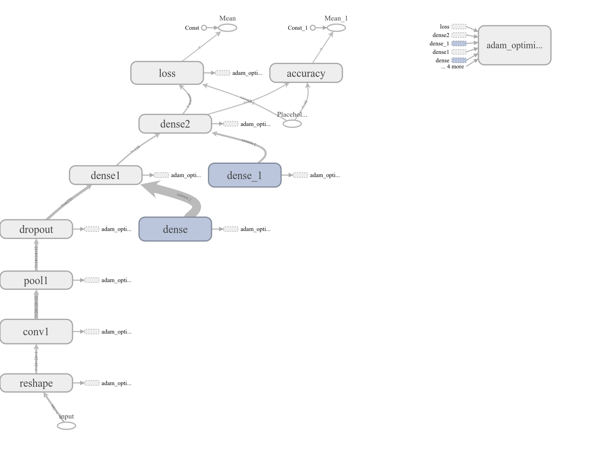

# Single Convolution for Fashion MNIST
## On Intel® Movidius™ Neural Compute Stick (NCS)

This is a TensorFlow™ implementation of a very simple convolution neural network (CNN), trained on Fashion MNIST. The model can be trained either on a CPU or GPU based system, and then deployed onto Intel® Movidius™ Neural Compute Stick (NCS) for inference.

This is a pictorial representation of the network used in this project.



> The accuracy of this network is quite low. By no means is this network proposed as a better alternative to those already listed on the Fashion MNIST website. The purpose of this project is simply to show how to deploy a custom TensorFlow neural network onto the NCS.

## Prerequisites

This sample project requires that the following componets are available:
1. <a href="https://developer.movidius.com/buy" target="_blank">Movidius Neural Compute Stick</a> (NCS)
2. <a href="https://developer.movidius.com/start" target="_blank">Movidius Neural Compute SDK</a> (NCSDK)
3. <a href="https://www.tensorflow.org/install/install_linux">TensorFlow installed</a> on a computer that is powerfull enough to run network training.
   * It could be a GPU or a CPU-Only system.

## Running the example

### Training: Download dataset, train the network and export model for inference.

Run these instructions within your tensorflow virtual environment or docker contrainer on your training hardware. In my case, it was `source ~/workspace/tensorflow/tf_env_py3/bin/activate`. These instructions will train the custom model on fashion MNIST dataset, and freezes the graph for inference. See `make freeze` target in `Makefile`.

```
mkdir -p ~/workspace
cd ~/workspace
git clone https://github.com/movidius/ncappzoo
cd ~/workspace/ncappzoo/tensorflow/single-conv/
export TF_SRC_PATH=path/to/your/tensorflow/source/directory
make
```

### Inference: Deploy the trained network on NCS.

Run these instructions on a system where NCSDK is installed. If NCSDK is not installed on the system where you trained and exported the model, copy `model/model-frozen.pb` over to the system with NCSDK. These instructions will convert your frozen TensorFlow graph into a Movidius graph file, which can then be loaded on to the NCS.

```
mkdir -p ~/workspace
cd ~/workspace
git clone https://github.com/movidius/ncappzoo
cd ~/workspace/ncappzoo/tensorflow/single-conv/
make compile
```

Now that you have a Movidius graph file, you can use either image-classifier or rapid-image-classifier to deploy it onto the NCS and run inferences. You will have to make some changes to the default app, so that you are pointing to the right graph file and the right test image.

> Like MNIST dataset, Fashion MNIST too is provided in IDX file format, where images are represented as matrices. For inference, you can either read those matrices directly into the NCS app, or you can first convert them to png images. I did the latter.

~~~
cd ~/workspace/ncappzoo/apps/image-classifier
python3 image-classifier.py --graph ~/workspace/ncappzoo/tensorflow/single-conv/model/graph --dim 28 28 --mean 0 --scale 0.00392 --colormode "monochrome" --labels ~/workspace/ncappzoo/tensorflow/single-conv/data/categories.txt --image ~/workspace/ncappzoo/tensorflow/single-conv/data/testing/0/7602.png 
~~~

> Note that the model was trained on 28x28 monochromatic images, so the inference will not work well if you try to pass an RGB image downloaded from the internet.

```
==============================================================
Top predictions for 7602.png
Execution time: 1.12351ms
--------------------------------------------------------------
99.5%	T-shirt/top
0.5%	Dress
0.0%	Ankle boot
0.0%	Bag
0.0%	Sneaker
0.0%	Shirt
==============================================================
```

You should also see the image on which the inference was performed.
